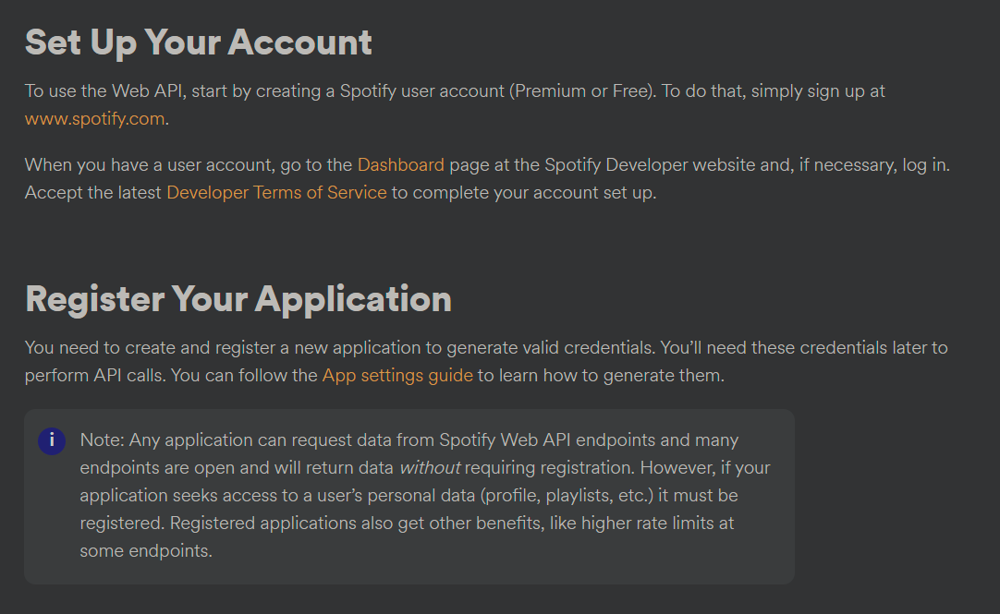
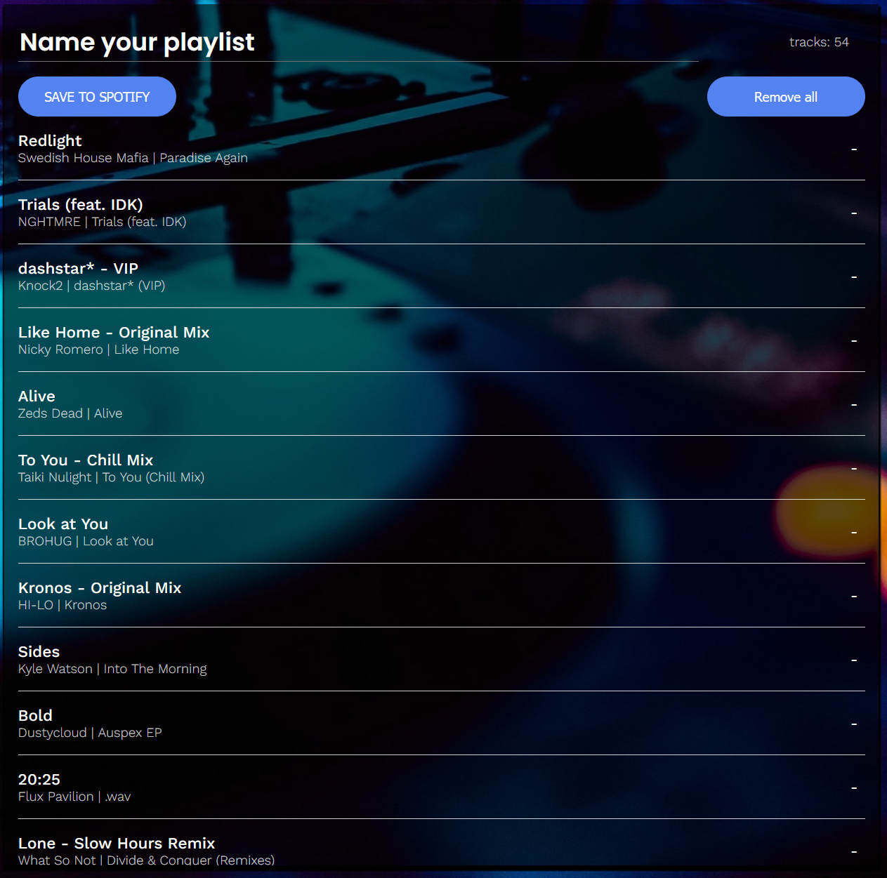
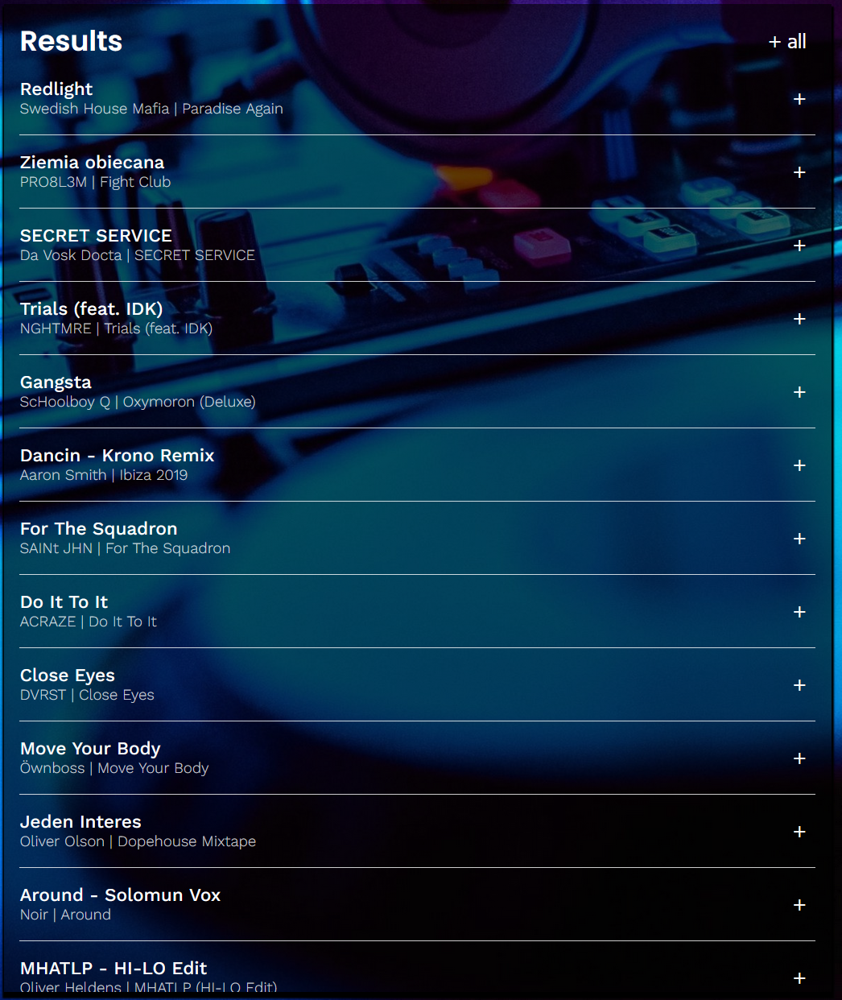
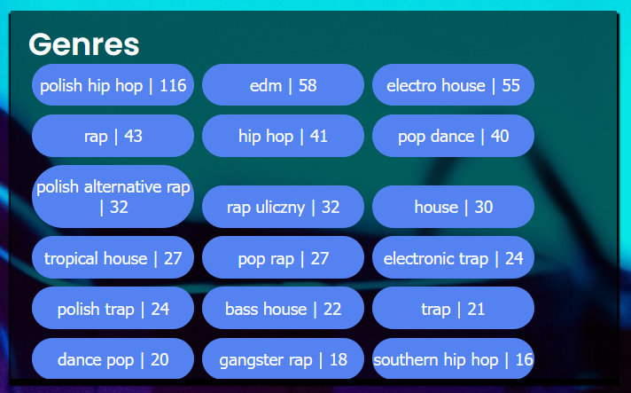
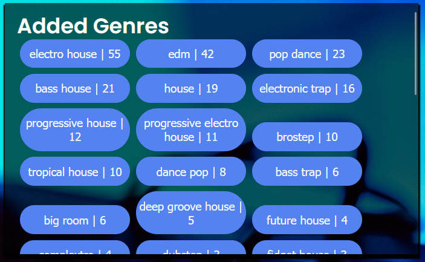
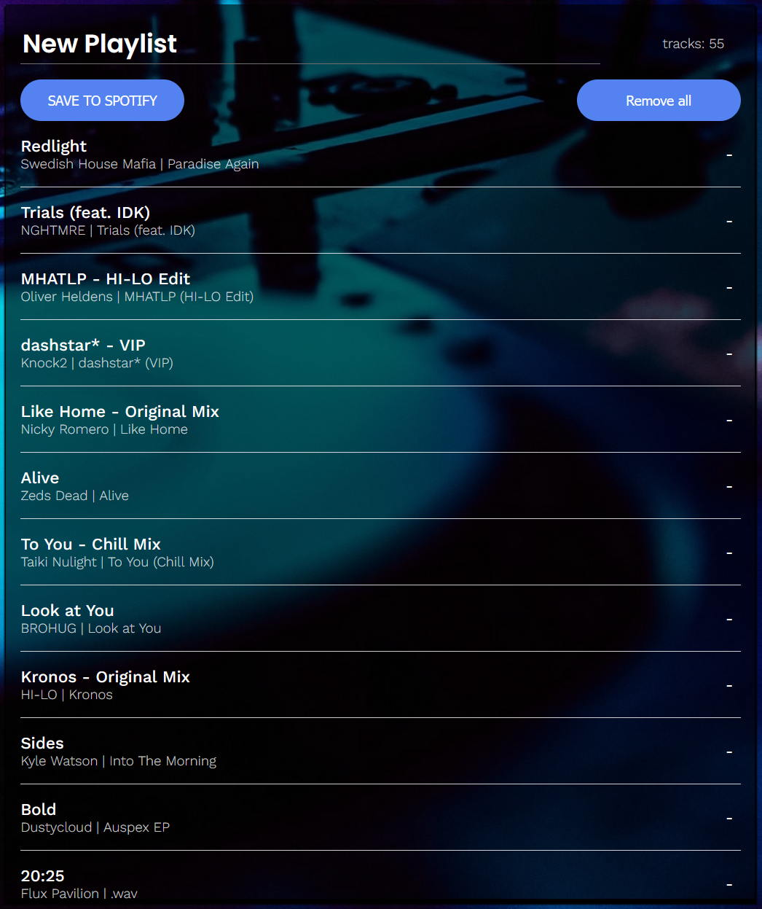

# Genrify 
The main goal of Genrify is to allow you to make playlists in Spotify based on a genre. 
# General Info
My motivation to make this app was to learn React and to implement a functionality that I think is missing from Spotify. I've got big library and no way to sort it out unless by clicking manually one by one. It can be done using Genrify in just a few clicks.
It might not always work perfect as Spotify Web API provides data where genre is assigned to an artist so there might be some cases where it doesn't match.
# Deployment
The app is up and running on Netlify https://genrify.netlify.app/. You have to log in using your Spotify credentials and send me an e-mail and write your e-mail address assigned to your Spotify account. Unfortunately, if you don't do it you will not be able to use the app. My app is still in development mode and due to Spotify Web API policy I have to whitelist your e-mail in the developer dashboard.
# Installation
If you don't want to use my app and/or send the e-mail or you just want to play around with the code you need to the following:

After sorting that out you need to download the repository from github and change the redirectUrl variable in App.js to 'http://localhost:3000/' and clientID for the one from your application and you're ready to go, you can run below command in the genrify directory\
npm start

# Usage
When you're logged in all your playlist will be downloaded to the Your playlists box in the top left corner.

## Your playlists
Your liked songs will always be at the very top of that list.\
After clicking on one of them, the songs from that playlists will be displayed in the box below called Results and genres of that songs will be displayed to the right in the box Genres with the actual number of the particular genre in the playlist.

## Results
In the Result box you can browse the songs from the chosen playlist and by clicking on the plus button you can add them one by one to your new playlist. You can also add all of the by clicking on +all.

## Genre
In that box all of the genres from chosen playlist will be displayed together with a number of songs of that specific genre. After clicking on a genre button you will add all of the songs of that genre to your new playlist and you will add that genre to Added Genres Box together with many others as well (remember that a song can have many genres).

## Added genres
Here will be displayed all of the genres that you actually have in your new playlist that you're creating at the moment. You can have lots of genres here just by adding one in Genre box.

## Your playlist
You can manage your new playlist here: name it, save it, remove specific and delete all tracks from it.

